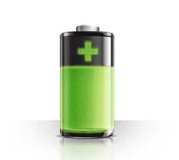

## bydhvs adapter for ioBroker

BYD HVS Battery poll data

## Ein wenig Erklärungen:

Prinzipiell ist der Adapter durch Anaylse der Datenpakete zwischen der BYD-App und dem BYD-Akku-System entstanden. Es werden im Wesentlichen die Daten aus dem TAB System Info und aus dem TAB Diagnosis dargestellt. Offensichtlich sind die Daten für "System Info" sofort in der Batterie bereit zum abholen, für die Diagnose-Daten sieht es so aus als wäre ein Messvorgang erforderlich, zwischen der Abfrage und den Werten muss ein Zeitintervall von gut 3 Sekunden eingehalten werden. 

Daher lasse ich die Diagnose-Daten auch nicht bei jeder Abfrage der Daten mit ermitteln.

## Zu den Einstellungen:
Intervall: Zeitlicher Abstand zwischen den Abfragen des Adapters

IP-Adresse: Eigentlich logisch, damit ist die IP-Adresse des Adapters gemeint. Dafür gibt es zwei Möglichkeiten: Entweder hält man sich an die Anleitung von Becker3 aus dem Photovoltaik-Forum, ist hier verlinkt: https://www.photovoltaikforum.com/thread/150898-byd-hvs-firmware-update/?postID=2215343#post2215343 . Das hat den Vorteil das auch die BYD-APP läuft und man mit dieser direkt an die Daten, auch zum Vergleich, herankommt. Oder man trägt "nur" die IP-Adresse die die BYD-Box per DHCP erhalten hat ein. Ausdrücklich waren möchte ich vor Änderungen an den IP-Einstellungen der BOX! Im Forum kann man Berichte von Leute lesen die sich die Erreichbarkeit der Box dauerhaft ruiniert haben. 

Batterie-Details: Steuerung, ob die Details zu den Zellen gelesen werden sollen

Lesezyklen zu Batterie-Details: Anzahl der "Normal-Lese-Zyklen" bis wieder einmal die Diagnose-Daten gelesen werden. Hier die Warnung dazu: Ich habe keine Idee ob man sich durch häufige Diagnose-Messungen Nachteile einhandelt, daher empfehle ich den Wert möglichst hoch zu setzen. Ich wüsste auch nicht was man mit den Diagnose-Daten im regelmäßigen Poll anfangen sollte.

Ich habe selber nur eine Box mit zwei Batterie-Blöcken. Ich erweitere gerne die Daten für größere Anlagen! Zusätzlich hat ein netter User mir Daten aus seiner Kommunikation mit einer 4-Block-Batterie zur Verfügung gestellt. Insofern sind die beiden Größen getestet. Für andere Kombinationen: Das Einzige was ich dafür benötige ist ein Wireshark-Mittschnitt des Datenverkehrs und einen Screenshot aus der BYD-App (Be-Connect).

## Changelog
<!--
	Placeholder for the next version (at the beginning of the line):
	### __WORK IN PROGRESS__
-->
### __WORK IN PROGRESS__
* Update all dependencies
* first public version
### 0.1.4-beta.0 (2021-04-02)
* 1st change with release-script
### 0.1.3
- Test Mode for getting hex data easily, removed check for 2 modules, moved "diagnosis-states" to extra folder, renaming CellStates
### 0.1.2
- Battery Voltage is unsigned, should now work with 4 modules
### 0.1.1
- start of documentation (German)
### 0.1.0
- (Christian) first testing release with (limited) public announcement
###

## License
MIT License

Copyright (c) 2021 Christian <github@familie-herrmann.de>

Permission is hereby granted, free of charge, to any person obtaining a copy
of this software and associated documentation files (the "Software"), to deal
in the Software without restriction, including without limitation the rights
to use, copy, modify, merge, publish, distribute, sublicense, and/or sell
copies of the Software, and to permit persons to whom the Software is
furnished to do so, subject to the following conditions:

The above copyright notice and this permission notice shall be included in all
copies or substantial portions of the Software.

THE SOFTWARE IS PROVIDED "AS IS", WITHOUT WARRANTY OF ANY KIND, EXPRESS OR
IMPLIED, INCLUDING BUT NOT LIMITED TO THE WARRANTIES OF MERCHANTABILITY,
FITNESS FOR A PARTICULAR PURPOSE AND NONINFRINGEMENT. IN NO EVENT SHALL THE
AUTHORS OR COPYRIGHT HOLDERS BE LIABLE FOR ANY CLAIM, DAMAGES OR OTHER
LIABILITY, WHETHER IN AN ACTION OF CONTRACT, TORT OR OTHERWISE, ARISING FROM,
OUT OF OR IN CONNECTION WITH THE SOFTWARE OR THE USE OR OTHER DEALINGS IN THE
SOFTWARE.